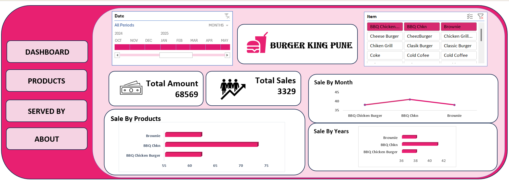
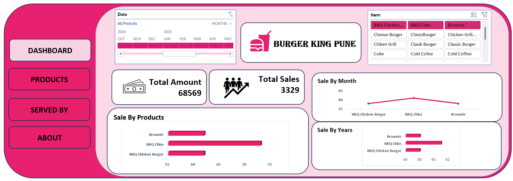
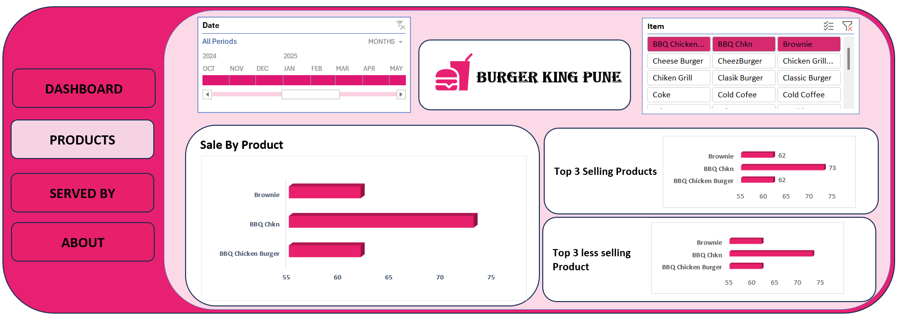
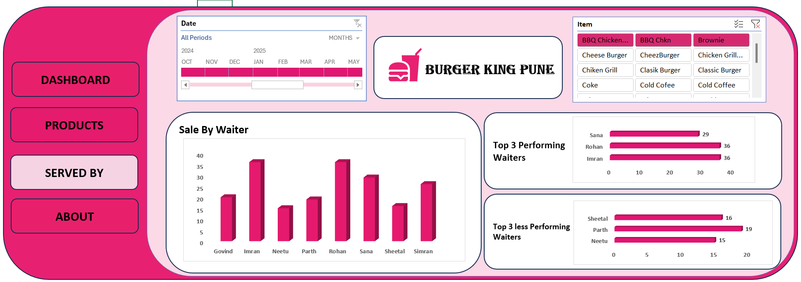
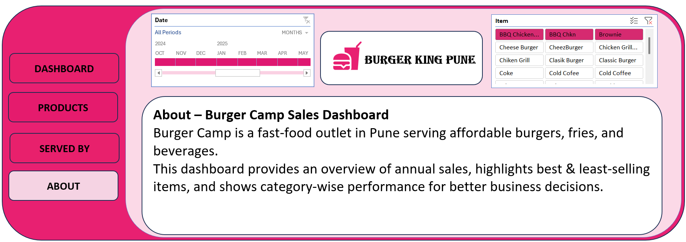

# 🍔Burger-King-Pune Dashboard
An interactive Excel Sales Analytics Dashboard designed to analyze Burger King’s sales performance, identify top-selling menu items, monitor staff performance, and track monthly revenue trends. This dashboard transforms raw restaurant sales data into meaningful visual insights to support better business and operational decisions. An interactive Excel-based Sales Analytics Dashboard built to analyze fast-food sales performance, track revenue trends, and generate actionable business insights from raw sales data. This project demonstrates how restaurant sales data can be transformed into meaningful visual stories to support smarter business decisions.

# 📌 Project Overview
The Burger King Sales Dashboard helps understand:

✔ Sales performance by products and categories

✔ Monthly and yearly sales trends

✔ Top-selling and least-selling products

✔ Waiter performance analysis

✔ Item-wise sales contribution

✔ Total sales and revenue overview

Instead of analyzing raw Excel sheets manually, this dashboard provides a visual decision-making tool for faster and clearer analysis.

# 🎯 Objective
The goal of this project is to:

1.Convert raw restaurant sales data into interactive insights

2.Identify best-selling and least-selling menu items

3.Track sales trends by month and year

4.Evaluate staff (waiter) performance

5.Help restaurant managers make data-driven decisions

6.Practice real-world Data Analyst workflow

# 🛠️ Tech Stack Used
📊 Microsoft Excel – Dashboard design and visualization

📂 Pivot Tables – Data summarization and aggregation

🧠 Excel Formulas – Calculated KPIs and metrics

📁 Cleaned Dataset – Raw to structured data transformation

📝 Data Modeling – Item, date, and staff relationships

# 📂 Data Source
The dataset is a restaurant sales dataset (Excel-based) containing:

1.Order-level transaction data

2.Product names and categories (Burger, Coffee, Fries, Desserts)

3.Date and time-based sales records

4.Waiter/staff performance data

5.Monthly and yearly sales records

6.Total sales amount and quantity sold

This dataset simulates a real-world fast-food restaurant scenario

# 📊 Dashboard Features & Insights
***🔢 Key Performance Indicators (KPIs)***

1.Total Amount: 68,569

2.Total Sales: 3,329 Orders

These KPIs give a quick snapshot of overall restaurant performance.

# 🛍 Sale by Products
Visual bar chart showing sales contribution by each product such as:

1.Double Patty Burger

2.Crispy Paneer Burger

3.Chicken Grill Burger

4.Cheese Burger

➡ Helps identify top-selling menu items.

# 🥇 Top 3 Selling Products
Highlights the highest-selling products based on revenue and quantity.

➡ Useful for menu optimization and inventory planning.

# 🔻 Top 3 Least Selling Products
Identifies low-performing products like fries or beverages.

➡ Helps in removing or promoting weak menu items.

# 👨‍🍳 Sale by Waiter
Analyzes sales generated by each waiter (staff performance).

➡ Helps in staff performance evaluation and incentive planning.

# 📅 Sale by Month
Time-based analysis showing how sales change across months.

➡ Useful for seasonal demand analysis.

# 📆 Sale by Years
Year-wise sales comparison to track business growth trends.

# 🧩 Interactive Filters
1.Date slicer

2.Product slicer

3.Waiter filter

➡ Enables dynamic exploration of sales data.

# 💡 Business Insights Derived
✔ Double Patty Burger is the highest-selling product

✔ Crispy Paneer and Chicken Grill burgers are strong performers

✔ Some products show low sales and need promotion or removal

✔ Certain waiters outperform others in sales contribution

✔ Sales show seasonal variation across months

✔ Overall restaurant revenue performance can be tracked easily

# 📷 Dashboard Preview

***Dashboard 1***

***Dashboard 2***

***Dashboard 3***

***Dashboard 4***

***Dashboard 5***

# 🚀 Conclusion

This project demonstrates how Microsoft Excel can be used as a powerful Business Intelligence tool to transform restaurant sales data into meaningful insights. It reflects practical skills in Excel dashboards, reporting, and business analytics.
